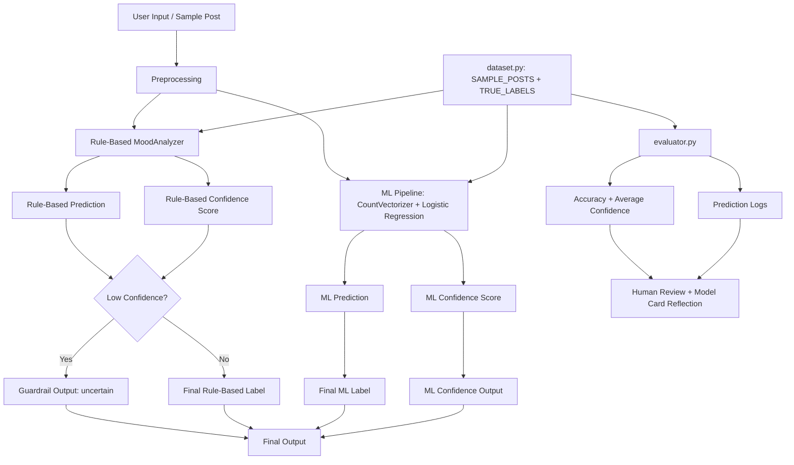

System Overview:

User input is processed and passed to both the rule-based and ML systems.
The rule-based system uses word matching and generates a confidence score.
The ML system uses CountVectorizer and Logistic Regression for prediction and confidence.
Guardrails return "uncertain" when rule-based confidence is too low.
evaluator.py compares predictions with true labels and computes metrics.
Human review is used for reflection and model evaluation.
